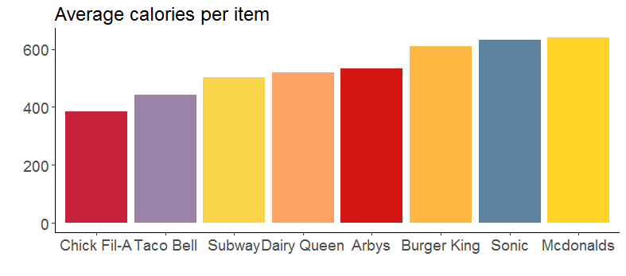

# TidyTuesday_2018-09-04

Working with fastfood data from 

data: https://github.com/rfordatascience/tidytuesday/blob/master/README.md

Inspiration: https://www.franchiseopportunities.com/blog/general-franchise-information/fast-food-calorie-comparison-charts

### Average calories per item
First, I tried to reproduce the example plot to visualize average calories per item for each restaurant.

### Average composition for the menu items in each restaurant
I wanted to visualize the average composition of entrees in each restaurant for elements that are more unhealthy (calories, total fat, carbs) and better elements (fiber, vitamins, ...). I am learning how to used gganimate so this was a good way to try it.

So for now, I would recommend to avoid Burger King, Sonic and Mcdonalds...
